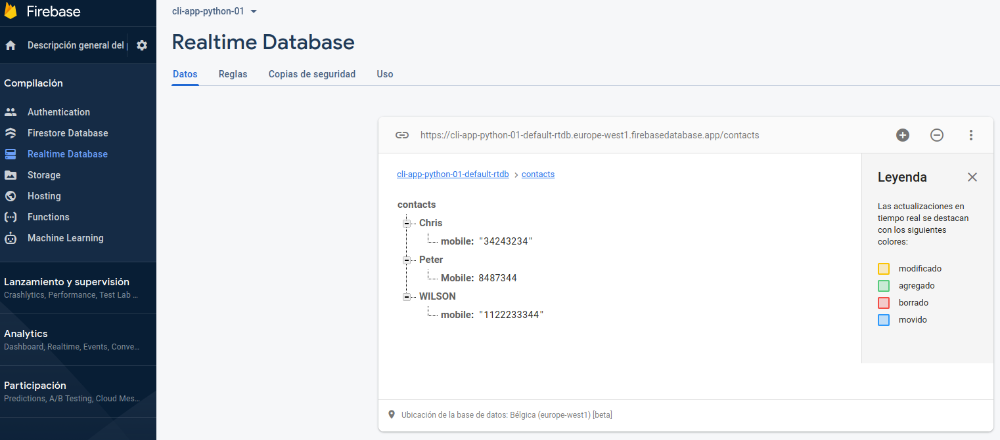

# cli_app_python_02
Building CLI Apps with Python and Firebase

# Comandos:
  - $ virtualenv venv
  - $ source venv/bin/activate
  - $ (venv) $ pip install Click
  - $ (venv) $ pip install --editable .
  - Load your environment variables
    $ . .env
  - 

# comandos disponibles:
  - $ contacts --help
  - $ contacts add WILSON -m 1122233344
  - $ contacts list
  

# Demo en firebase
  1) Create realtime database in Firebase
    

  2) Documentation:  https://firebase.google.com/docs/reference/rest/database

  3) Test conection in command Line:
    $ curl 'https://cli-app-python-01-default-rtdb.europe-west1.firebasedatabase.app/contacts.json'
    out: {"Peter":{"Mobile":8487344}}

# Referencias
 - https://dev.to/wangonya/performing-crud-operations-with-a-cli-app-using-firebase-2h3e
